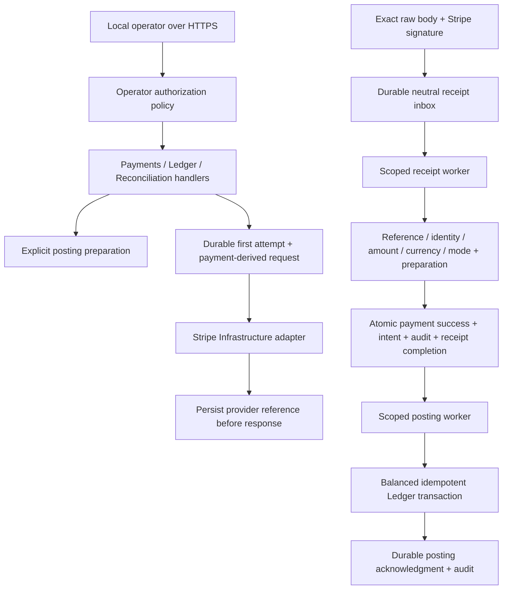

# Backend architecture

SettleCore is a modular monolith. The API composes module services and hosted workers; each module owns its domain/application contracts and a separate Infrastructure project. PostgreSQL stores and migration histories can be separated by module, as in the acceptance flow. Infrastructure dependencies are injected; the Payments Domain/Application projects contain no Stripe SDK types.

## Boundaries

**Payments** owns local payment identity/status, immutable posting preparation, provider references, creation-attempt age, durable success receipts, posting intents, retry schedules and lifecycle audit. Its provider ports use neutral request/result/evidence types. Stripe creation/retrieval/webhook decoding and SDK types reside exclusively in Payments Infrastructure.

**Ledger** owns account identity/ledger/currency and balanced transaction rules. Provisioning accepts caller-selected IDs and normalizes the three-letter ASCII currency code. PostgreSQL insert-on-conflict plus immutable-content comparison allows identical replays and rejects different ledger/currency for the same account. Transactions require existing matching accounts, balanced entries and explicit transaction IDs. Conflicting transaction replays are rejected, including concurrent writers.

**Reconciliation** persists deterministic comparisons of explicitly supplied expected and actual amount/currency. It does not infer provider settlement data or replace original-intent verification. Provider orphan recovery is a separate Payments use case.

**API** applies one local operator policy to every Payments/Ledger/Reconciliation route. Health and the separately mapped, signed Stripe webhook are public. Configuration validation fails closed for missing operator credentials and incomplete enabled integrations. The single-operator model matches this local portfolio scope; customer/tenant identity management is outside it.

## Consistency and recovery

1. Payment creation stores a local Pending payment. Preparing posting inputs does not invent accounts, fee policy or routing.
2. Provider creation records the first attempt before outbound I/O and derives its idempotency key from the SettleCore payment ID. Creation observations never authorize local success. Reference persistence precedes returning the response-only client secret.
3. Stripe composition allows automatic creation retry only inside 23 hours from the immutable first attempt. Expired or future-dated attempts are blocked. After that, the operator must establish the original intent; a supplied reference is retrieved and correlated before durable attachment. Recovery never calls creation, resets age or marks success. Uncertain or multiple candidate intents require investigation, not recreation.
4. Webhook ingress authenticates the raw signed envelope and configured mode, then awaits durable receipt persistence before acknowledging it. Identical evidence replays succeed; conflicting evidence is rejected. Raw payloads and client secrets are not stored.
5. The receipt processor requires matching local reference, amount, currency, mode and explicit preparation. It saves success, the posting intent, audit and receipt processing time in one Payments transaction. Missing prerequisites defer processing; durable schedules prevent one deferred receipt from starving others.
6. Ledger delivery and Payments acknowledgment cross database boundaries. The posting worker therefore provides retryable delivery, while Ledger's caller-supplied transaction identity provides idempotent effects. A crash after Ledger commit and before acknowledgment retries the same transaction; acknowledgment timestamps and audit remain durable. This is not a distributed database transaction or a promise of exactly-once network delivery.

The system cannot determine the historical age of outbound requests made before the first-attempt mechanism existed. Such payments require explicit original-intent investigation. A local reference lookup also cannot prove no other remote object exists; never treat absence from a provider search as permission to create a replacement.

## Operations and evidence

Both workers create scopes per unit of work, retain durable retries across host restarts and honor cancellation. Completion counters measure processing outcomes, including replays, rather than unique economic events. Counters have no identity tags. Dependency readiness checks all three connections and pending migrations; liveness does not depend on databases. Migrations are applied explicitly before workers are enabled.

Tests cover domain/application rules, real PostgreSQL migrations and concurrency, HTTP composition, startup configuration, real SDK payloads over fake transport, signed evidence and complete worker-to-Ledger acceptance. The [acceptance record](ACCEPTANCE.md) distinguishes these from optional external Stripe TEST-mode verification.
